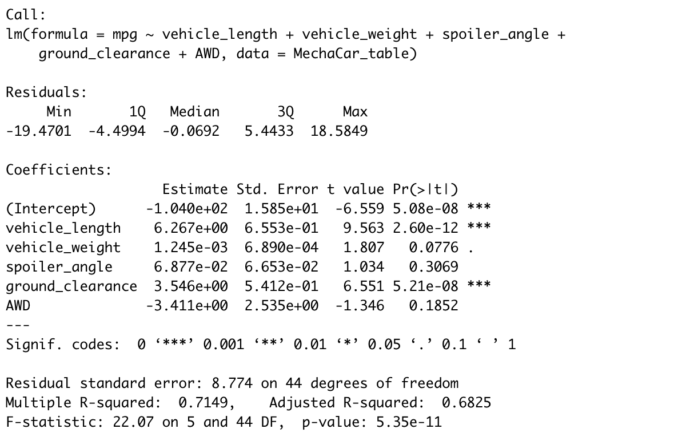
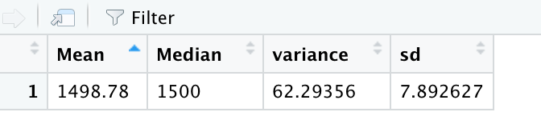
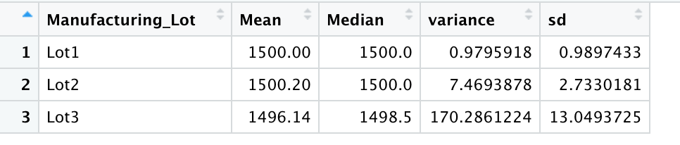
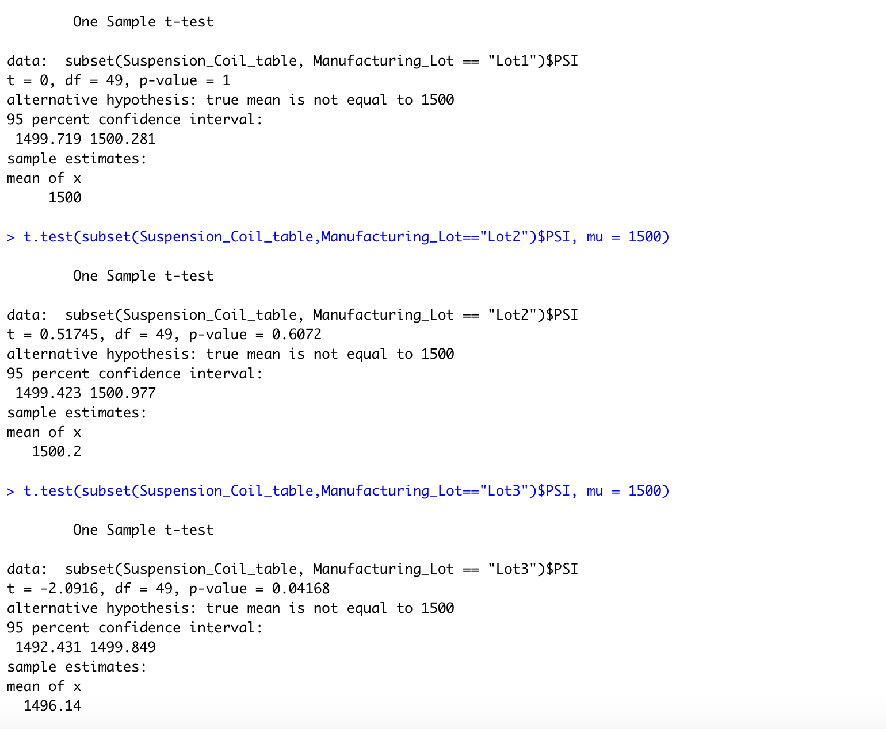

# MechaCar_Statistical_Analysis

## Linear Regression to Predict MPG
I would say that vehicle length and ground clearance are two variables that provide a non random amount of variance to the mpg values in the dataset because for both instances, the p value is smaller than 0.05. 

The slope of the linear model is not considered to be zero because the p value is smaller that 0.05 so the slope is not considered to be 0. 

I think that this linear model does predict mpg of Mecha Car prototypes effectively because all of the independent variables such as vehicle weight, spoiler angle, ground clearance, and AWD are all good variables to test how it affects the mpg. We can use the p values to determine how likely it is that our data can occur during the null hypothesis. 

Regression formula with summary of regression: 

## Summary Statistics on Suspension Coils
If the design specifications for the MechaCar suspension coils dictate that the variance of the suspension coils should not exceed 100 pounds per square inch, it means that the current manufacturing data does meet this design specification for every lot including all manufacturing lots except the third lot because the variance in numbers for the third lot is over 100.  

Statistical summary of PSI of Suspension Coils

## T-Tests on Suspension Coils
The p-value from lot 1 and lot 2 is greater than than .05, meaning we can assume the PSI values are not statically different. The p value for Lot 3 is assumed to be of .04168. This implies that the PSI is indeed statically different from the population.

T-Test Statistical Summary on Suspension COils: 
 

## Study Design: MechaCar vs Competition
I would create a test saying the larger the car in size, the lower the gas per milage. After finding the mean car sizes of all car sizes, for the null hypothesis I would expect that the larger the size of the car it would result in lower gas per milage. The alternative hypothesis would say that the larger the size of the car, it would result in higher gas per milage.
 
